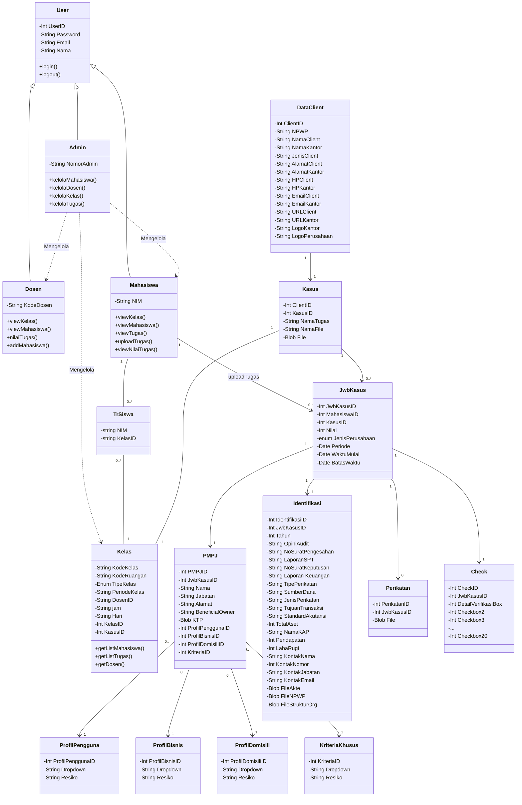

## Mermaid


&nbsp;

## API Endpoints
Check api_test folder

## To Do
- Cek apakah ada email yang sama di DB, supaya tidak bisa insert duplicate email
- Delete tidak bisa karena DB schema/relasi antara kasus dan kelas

## Terminal

### Populate database with dummy data
```php
php artisan migrate:fresh --seed
```

### Initialize empty database
```php
php artisan migrate:fresh
```
### initialize test database 
dengan dummy data yang pasti supaya lbh mudah test API
```php
php artisan db:seed --class=TestSeeder
```

### Launch server to test API
```php
php artisan serve
```

### DB
```php
php artisan tinker
```

List semua objek, di contoh ini merupakan User
```
User::all();
```

List semua tabel
```
Schema::getTableListing();
```
&nbsp;
Lihat nama semua kolom di suatu tabel
```
Schema::getColumnListing('users');
```

Lihat metadata/definisi nilai kolom
```
Schema::getColumns('users');
```

Lihat constraints/behavior/relasi suatu tabel dengan tabel lain, bila ada
```
Schema::getForeignKeys('kelas');
```