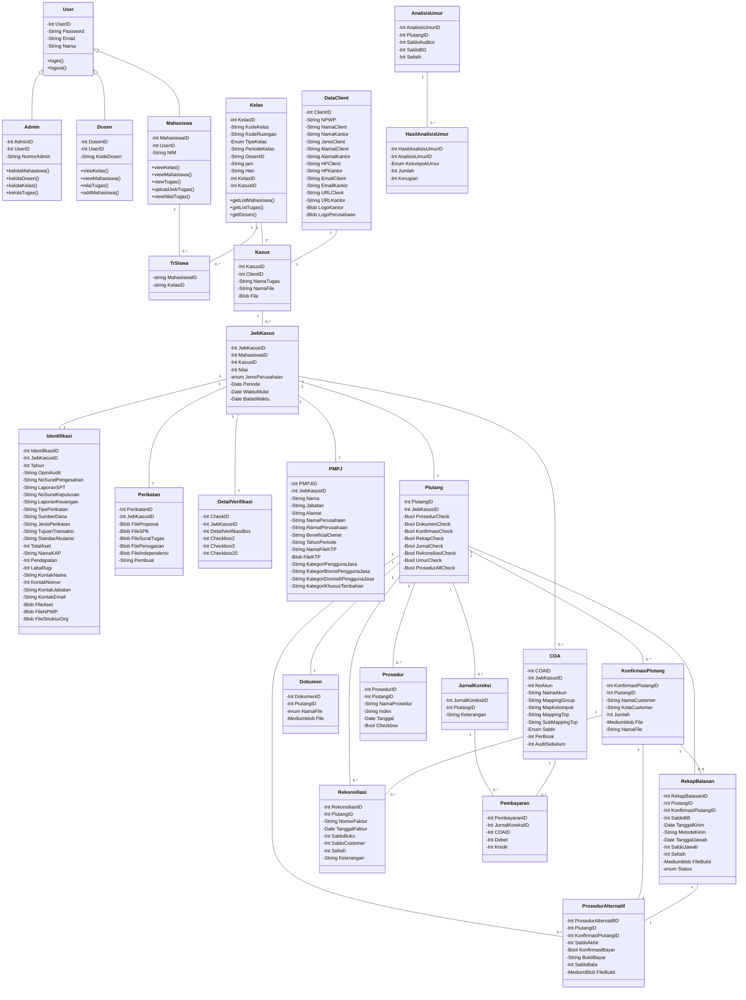

```mermaid
classDiagram

    %% Inheritance / User Hierarchy
    class User {
        -Int UserID
        -String Password
        -String Email
        -String Nama
        +login()
        +logout()
    }

    class Admin {
        -Int AdminID
        -Int UserID
        -String NomorAdmin
        +kelolaMahasiswa()
        +kelolaDosen()
        +kelolaKelas()
        +kelolaTugas()
    }

    class Dosen {
        -Int DosenID
        -Int UserID
        -String KodeDosen
        +viewKelas()
        +viewMahasiswa()
        +nilaiTugas()
        +addMahasiswa()
    }

    class Mahasiswa {
        -Int MahasiswaID
        -Int UserID
        -String NIM
        +viewKelas()
        +viewMahasiswa()
        +viewTugas()
        +uploadJwbTugas()
        +viewNilaiTugas()
    }

    User <|-- Admin
    User <|-- Dosen
    User <|-- Mahasiswa

    %% Core Academic Entities
    class Kelas {
        -Int KelasID
        -String KodeKelas
        -String KodeRuangan
        -Enum TipeKelas
        -String PeriodeKelas
        -String DosenID
        -String jam
        -String Hari
        -Int KelasID
        -Int KasusID
        +getListMahasiswa()
        +getListTugas()
        +getDosen()
    }

    class TrSiswa {
        -string MahasiswaID
        -string KelasID
    }

    class Kasus {
        -Int KasusID
        -Int ClientID
        -String NamaTugas
        -String NamaFile
        -Blob File
    }

    class JwbKasus {
        -Int JwbKasusID
        -Int MahasiswaID
        -Int KasusID
        -Int Nilai
        -enum JenisPerusahaan
        -Date Periode
        -Date WaktuMulai
        -Date BatasWaktu
    }

    Mahasiswa "1" -- "0..*" TrSiswa
    Kelas "1" -- "0..*" TrSiswa
    Kelas "1" -- "1*" Kasus
    Kasus "1" -- "0..*" JwbKasus

    %% Client & General Data
    class DataClient {
        -Int ClientID
        -String NPWP
        -String NamaClient
        -String NamaKantor
        -String JenisClient
        -String AlamatClient
        -String AlamatKantor
        -String HPClient
        -String HPKantor
        -String EmailClient
        -String EmailKantor
        -String URLClient
        -String URLKantor
        -Blob LogoKantor
        -Blob LogoPerusahaan
    }

    DataClient "1" -- "1" Kasus

    %% Case Details & Audit Steps
    class Identifikasi {
        -Int IdentifikasiID
        -Int JwbKasusID
        -Int Tahun
        -String OpiniAudit
        -String NoSuratPengesahan
        -String LaporanSPT
        -String NoSuratKeputusan
        -String LaporanKeuangan
        -String TipePerikatan
        -String SumberDana
        -String JenisPerikatan
        -String TujuanTransaksi
        -String StandarAkutansi
        -Int TotalAset
        -String NamaKAP
        -Int Pendapatan
        -Int LabaRugi
        -String KontakNama
        -Int KontakNomor
        -String KontakJabatan
        -String KontakEmail
        -Blob FileAset
        -Blob FileNPWP
        -Blob FileStrukturOrg
    }

    class Perikatan {
        -Int PerikatanID
        -Int JwbKasusID
        -Blob FileProposal
        -Blob FileSPK
        -Blob FileSuratTugas
        -Blob FilePenugasan
        -Blob FileIndependensi
        -String Pembuat
    }

    class DetailVerifikasi {
        -Int CheckID
        -Int JwbKasusID
        -Int DetailVerifikasiBox
        -Int Checkbox2
        -Int Checkbox3
        -Int Checkbox20
    }

    class PMPJ {
        -Int PMPJID
        -Int JwbKasusID
        -String Nama
        -String Jabatan
        -String Alamat
        -String NamaPerusahaan
        -String AlamatPerusahaan
        -String BeneficialOwner
        -String TahunPeriode
        -String NamaFileKTP
        -Blob FileKTP
        -String KategoriPenggunaJasa
        -String KategoriBisnisPenggunaJasa
        -String KategoriDomisiliPenggunaJasa
        -String KategoriKhususTambahan
    }

    JwbKasus "1" -- "1" Identifikasi
    JwbKasus "1" -- "1" Perikatan
    JwbKasus "1" -- "1" DetailVerifikasi
    JwbKasus "1" -- "1" PMPJ

    %% Financial / COA Setup
    class COA {
        -Int COAID
        -Int JwbKasusID
        -Int NoAkun
        -String NamaAkun
        -String MappingGroup
        -String MapKelompok
        -String MappingTop
        -String SubMappingTop
        -Enum Saldo
        -Int PerBook
        -Int AuditSebelum
    }

    class AnalisisUmur {
        -Int AnalisisUmurID
        -Int PiutangID
        -Int SaldoAuditor
        -Int SaldoBG
        -Int Selisih
    }

    class HasilAnalisisUmur {
        -Int HasilAnalisisUmurID
        -Int AnalisisUmurID
        -Enum KelompokUmur
        -Int Jumlah
        -Int Kerugian
    }

    class Dokumen {
        -Int DokumenID
        -Int PiutangID
        -enum NamaFile
        -Mediumblob File
    }

    JwbKasus "1" -- "0..*" COA
    AnalisisUmur "1" -- "0..*" HasilAnalisisUmur

    %% Receivables (Piutang) & Reconciliation Module
    class Piutang {
        -Int PiutangID
        -Int JwbKasusID
        -Bool ProsedurCheck
        -Bool DokumenCheck
        -Bool KonfirmasiCheck
        -Bool RekapCheck
        -Bool JurnalCheck
        -Bool RekonsiliasiCheck
        -Bool UmurCheck
        -Bool ProsedurAllCheck
    }

    class RekapBalasan {
        -Int RekapBalasanID
        -Int PiutangID
        -Int KonfirmasiPiutangID
        -Int SaldoBB
        -Date TanggalKirim
        -String MetodeKirim
        -Date TanggalJawab
        -Int SaldoJawab
        -Int Selisih
        -Mediumblob FileBukti
        -enum Status
    }

    class Rekonsiliasi {
        -Int RekonsiliasiID
        -Int PiutangID
        -String NomorFaktur
        -Date TanggalFaktur
        -Int SaldoBuku
        -Int SaldoCustomer
        -Int Selisih
        -String Keterangan
    }

    class ProsedurAlternatif {
        -Int ProsedurAlternatifID
        -Int PiutangID
        -Int KonfirmasiPiutangID
        -Int SaldoAkhir
        -Bool KonfirmasiBayar
        -String BuktiBayar
        -Int SaldoBata
        -MediumBlob FileBukti
    }

    class KonfirmasiPiutang {
        -Int KonfirmasiPiutangID
        -Int PiutangID
        -String NamaCustomer
        -String KotaCustomer
        -Int Jumlah
        -Mediumblob File
        -String NamaFile
    }

    JwbKasus "1" -- "1" Piutang
    Piutang "1" -- "0..*" RekapBalasan
    Piutang "1" -- "0..*" Rekonsiliasi
    Piutang "1" -- "0..*" ProsedurAlternatif
    Piutang "1" -- "0..*" KonfirmasiPiutang
    Piutang "1" -- "1" Dokumen

    KonfirmasiPiutang "1" -- "1" RekapBalasan
    KonfirmasiPiutang "1" -- "1" ProsedurAlternatif
    KonfirmasiPiutang "1" -- "0..*" Rekonsiliasi
    RekapBalasan "1" -- "1" ProsedurAlternatif

    %% Audit Adjustment / Procedure Entries
    class Prosedur {
        -Int ProsedurID
        -Int PiutangID
        -String NamaProsedur
        -String Index
        -Date Tanggal
        -Bool Checkbox
    }

    class JurnalKoreksi {
        -Int JurnalKoreksiID
        -Int PiutangID
        -String Keterangan
    }

    class Pembayaran {
        -Int PembayaranID
        -Int JurnalKoreksiID
        -Int COAID
        -Int Debet
        -Int Kredit
    }

    Piutang "1" -- "0..*" Prosedur
    Piutang "1" -- "0..*" JurnalKoreksi
    JurnalKoreksi "1" -- "0..*" Pembayaran
    COA "1" -- "0..*" Pembayaran
```