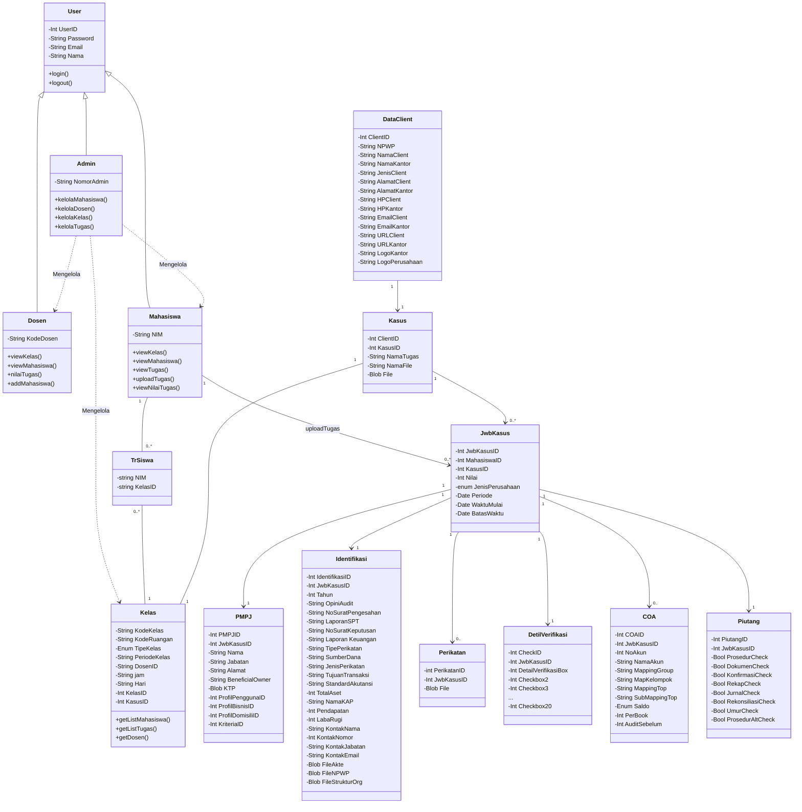

```mermaid
classDiagram
    direction TB

    class User {
        -Int UserID
        -String Password
        -String Email
        -String Nama
        +login()
        +logout()
    }

    class Admin {
        -String NomorAdmin
        +kelolaMahasiswa()
        +kelolaDosen()
        +kelolaKelas()
        +kelolaTugas()
    }

    class Dosen {
        -String KodeDosen
        +viewKelas()
        +viewMahasiswa()
        +nilaiTugas()
        +addMahasiswa()
    }

    class Mahasiswa {
        -String NIM
        +viewKelas()
        +viewMahasiswa()
        +viewTugas()
        +uploadTugas()
        +viewNilaiTugas()
    }

    class TrSiswa {
        -string NIM
        -string KelasID
    }

    class Kelas {
        -String KodeKelas
        -String KodeRuangan
        -Enum TipeKelas
        -String PeriodeKelas
        -String DosenID
        -String jam
        -String Hari
        -Int KelasID
        -Int KasusID
        +getListMahasiswa()
        +getListTugas()
        +getDosen()
    }

    class JwbKasus {
        -Int JwbKasusID
        -Int MahasiswaID
        -Int KasusID
        -Int Nilai
        -enum JenisPerusahaan
        -Date Periode
        -Date WaktuMulai
        -Date BatasWaktu
    }

    class Kasus {
        -Int ClientID
        -Int KasusID
        -String NamaTugas
        -String NamaFile
        -Blob File
    }

    class DataClient {
        -Int ClientID
        -String NPWP
        -String NamaClient
        -String NamaKantor
        -String JenisClient
        -String AlamatClient
        -String AlamatKantor
        -String HPClient
        -String HPKantor
        -String EmailClient
        -String EmailKantor
        -String URLClient
        -String URLKantor
        -String LogoKantor
        -String LogoPerusahaan
    }

    class PMPJ {
        -Int PMPJID
        -Int JwbKasusID
        -String Nama
        -String Jabatan
        -String Alamat
        -String BeneficialOwner
        -Blob KTP
        -Int ProfilPenggunaID
        -Int ProfilBisnisID
        -Int ProfilDomisiliID
        -Int KriteriaID
    }

    class Identifikasi {
        -Int IdentifikasiID
        -Int JwbKasusID
        -Int Tahun
        -String OpiniAudit
        -String NoSuratPengesahan
        -String LaporanSPT
        -String NoSuratKeputusan
        -String Laporan Keuangan
        -String TipePerikatan
        -String SumberDana
        -String JenisPerikatan
        -String TujuanTransaksi
        -String StandardAkutansi
        -Int TotalAset
        -String NamaKAP
        -Int Pendapatan
        -Int LabaRugi
        -String KontakNama
        -Int KontakNomor
        -String KontakJabatan
        -String KontakEmail
        -Blob FileAkte
        -Blob FileNPWP
        -Blob FileStrukturOrg 
    }

    class Perikatan {
        -int PerikatanID
        -Int JwbKasusID
        -Blob File
    }

    class DetilVerifikasi {
        -Int CheckID
        -Int JwbKasusID
        -Int DetailVerifikasiBox
        -Int Checkbox2
        -Int Checkbox3
        ...
        -Int Checkbox20
    }

    class COA {
        -Int COAID
        -Int JwbKasusID
        -Int NoAkun
        -String NamaAkun
        -String MappingGroup
        -String MapKelompok
        -String MappingTop
        -String SubMappingTop
        -Enum Saldo
        -Int PerBook
        -Int AuditSebelum
    }

    class Piutang {
        -Int PiutangID
        -Int JwbKasusID
        -Bool ProsedurCheck
        -Bool DokumenCheck
        -Bool KonfirmasiCheck
        -Bool RekapCheck
        -Bool JurnalCheck
        -Bool RekonsiliasiCheck
        -Bool UmurCheck
        -Bool ProsedurAltCheck
    }

    %% Inheritance
    User <|-- Admin
    User <|-- Dosen
    User <|-- Mahasiswa

    %% Admin management
    Admin ..> Dosen : Mengelola
    Admin ..> Mahasiswa : Mengelola
    Admin ..> Kelas : Mengelola

    %% Dosen - Mahasiswa - Kelas
    Mahasiswa "1" -- "0..*" TrSiswa
    TrSiswa "0..*" -- "1" Kelas

    %% Mahasiswa mengumpulkan Kasus
    Mahasiswa "1" --> "0..*" JwbKasus : uploadTugas

    %% Kasus
    Kasus "1" --> "0..*" JwbKasus
    Kasus "1" -- "1" Kelas

    %% Client relationship
    DataClient "1" --> "1" Kasus

    %% JwbKasus & Audit
    JwbKasus "1" --> "1" PMPJ
    JwbKasus "1" --> "1" Identifikasi
    JwbKasus "1" --> "0.." Perikatan
    JwbKasus "1" --> "1" DetilVerifikasi
    JwbKasus "1" --> "0.." COA
    JwbKasus "1" --> "1" Piutang
```